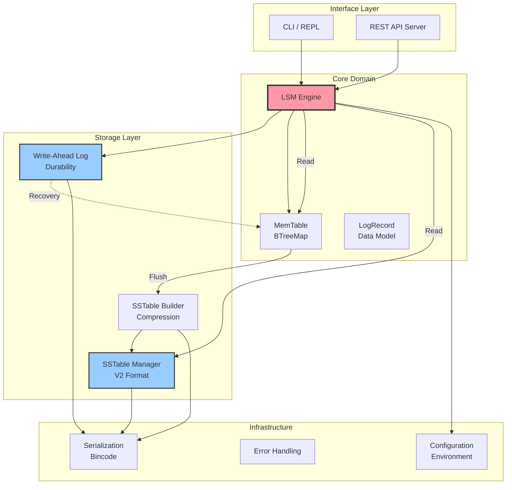

<p align="center">
  
</p>

<h1 align="center">ApexStore</h1>

<p align="center">
  <strong>High-performance, embedded Key-Value engine built with Rust 🦀</strong>
  <br />
  <em>Implementing LSM-Tree architecture with a focus on SOLID principles, observability, and performance.</em>
</p>

<p align="center">
  <a href="https://elioneto.github.io/ApexStore/"></a>
  <a href="https://opensource.org/licenses/MIT"></a>
  <a href="https://www.rust-lang.org/"></a>
  <a href="https://github.com/ElioNeto/ApexStore/releases"></a>
  <a href="https://www.docker.com/"></a>
  <a href="https://github.com/ElioNeto/ApexStore/actions"></a>
</p>

---

## 🎯 Overview

ApexStore is a modern, Rust-based storage engine designed for write-heavy workloads. It combines the durability of write-ahead logging (WAL) with the efficiency of **Log-Structured Merge-Tree (LSM-Tree)** architecture. 

Built from the ground up using **SOLID principles**, it provides a production-grade storage solution that is easy to reason about, test, and maintain, while delivering the performance expected from a systems-level language.

## ⚖️ Why ApexStore?

While industry giants like RocksDB or LevelDB focus on extreme complexity, ApexStore offers:

- **Educational Clarity**: A clean, modular implementation of LSM-Tree that serves as a blueprint for high-performance systems.
- **Strict SOLID Compliance**: Leveraging Rust's ownership model to enforce clear boundaries between MemTable, WAL, and SSTable layers.
- **Observability First**: Built-in real-time metrics for memory, disk usage, and WAL health.
- **Modern Defaults**: Native LZ4 compression, Bloom Filters, and 35+ tunable parameters via environment variables.

## 📊 Performance Benchmarks

*Measured on AMD Ryzen 9 5900X, NVMe SSD (v1.4.0)*

| Operation | Throughput | Visual |
|-----------|------------|--------|
| **In-Memory Writes** | ~500k ops/s | ████████████████ 100% |
| **Writes (with WAL)** | ~100k ops/s | ███ 20% |
| **Batch Writes** | ~1M ops/s | ██████████████████████████████ 200% |
| **MemTable Hits** | ~1.2M ops/s | █████████████████████████████████ 240% |
| **SSTable Reads** | ~50k ops/s | █ 10% |

> **Note:** The performance difference between In-Memory and WAL writes highlights the fsync overhead, which can be optimized via `WAL_SYNC_MODE`.

## ✨ Key Features

### 🛠️ Storage Engine
- **MemTable**: In-memory BTreeMap with configurable size limits.
- **Write-Ahead Log (WAL)**: ACID-compliant durability with configurable sync modes.
- **SSTable V2**: Block-based storage with Sparse Indexing and LZ4 Compression.
- **Bloom Filters**: Drastically reduces unnecessary disk I/O for read operations.
- **Crash Recovery**: Automatic WAL replay on startup to ensure zero data loss.

### 🔌 Access Patterns
- **Interactive CLI**: REPL interface for development and debugging.
- **REST API**: Full HTTP API with JSON payloads for microservices.
- **Batch Operations**: Efficient bulk inserts and updates.
- **Search Capabilities**: Prefix and substring search (Optimized iterators coming in v2.0).

## 🏗️ Architecture

The engine follows a modular architecture where each component has a single responsibility:



## 🚀 Quick Start

### Prerequisites
- **Rust 1.70+**: Install via [rustup.rs](https://rustup.rs/)

### Installation & Run
```bash
# Clone and enter
git clone https://github.com/ElioNeto/ApexStore.git && cd ApexStore

# Build and Start REPL
cargo run --release

# Available commands:
# > put user:1 "John Doe"
# > get user:1
# > stats
```

## 🐳 Docker Deployment

Run ApexStore as a standalone API server:

```bash
# Start with Docker Compose
docker-compose up -d

# Manual run with custom config
docker run -d \
  --name apexstore-server \
  -p 8080:8080 \
  -e MEMTABLE_MAX_SIZE=33554432 \
  -v apexstore-data:/data \
  elioneto/apexstore:latest
```

## 🌐 REST API Examples

| Method | Endpoint | Description |
|--------|----------|-------------|
| `POST` | `/keys` | Insert/Update: `{"key": "k1", "value": "v1"}` |
| `GET` | `/keys/{key}` | Retrieve value |
| `GET` | `/stats/all` | Full telemetry (Memory, Disk, WAL) |

## 📁 Project Structure

```
ApexStore/
├── src/
│   ├── core/      # LSM Engine, MemTable, Domain logic
│   ├── storage/   # WAL, SSTable V2, Block Builder
│   ├── infra/     # Codec, Error Handling, Config
│   ├── api/       # Actix-Web Server & Handlers
│   └── cli/       # REPL Implementation
├── docs/          # Detailed documentation & Architecture
├── tests/         # Integration test suite
└── Dockerfile     # Multi-stage build
```

## 🧪 Testing & Quality

```bash
cargo test                 # Run all tests
cargo clippy -- -D warnings # Linting
cargo fmt                  # Formatting
```

## 🗺️ Roadmap

- [x] SSTable V2 with compression & Bloom Filters
- [x] REST API & Feature Flags
- [x] Global Block Cache
- [ ] **v1.5**: Storage iterators for range queries
- [ ] **v1.6**: Concurrent read optimization
- [ ] **v2.0**: Leveled/Tiered Compaction Strategies

## 🤝 Contributing

Contributions are what make the open-source community an amazing place! Please check our [Contributing Guidelines](docs/CONTRIBUTING.md).

1. Fork the Project
2. Create your Feature Branch (`git checkout -b feature/AmazingFeature`)
3. Commit your Changes (`git commit -m 'feat: add amazing feature'`)
4. Push to the Branch (`git push origin feature/AmazingFeature`)
5. Open a Pull Request

## 📄 License

Distributed under the MIT License. See `LICENSE` for more information.

## 📧 Contact

**Elio Neto** - [GitHub](https://github.com/ElioNeto) - netoo.elio@hotmail.com  
**Demo**: [lsm-admin-dev.up.railway.app](https://lsm-admin-dev.up.railway.app/)

## 🌟 Star History

[](https://star-history.com/#ElioNeto/ApexStore&Date)

---
<p align="center">Built with 🦀 Rust and ❤️ for high-performance storage systems</p>
