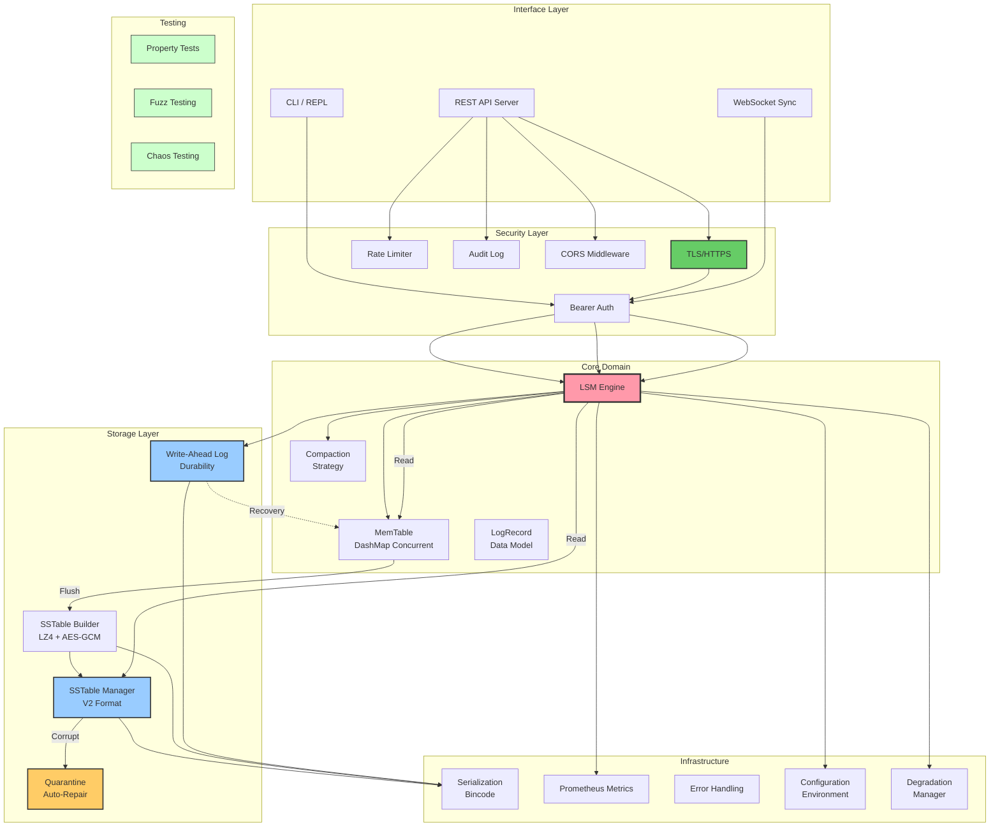
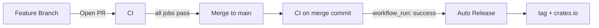

<p align="center">
 
</p>

<h1 align="center">ApexStore</h1>

<p align="center">
  <strong>High-performance, embedded Key-Value engine built with Rust 🦀</strong>
  <br />
  <em>Implementing LSM-Tree architecture with a focus on SOLID principles, observability, and performance.</em>
</p>

<p align="center">
  <a href="https://elioneto.github.io/ApexStore/"></a>
  <a href="https://opensource.org/licenses/MIT"></a>
  <a href="https://www.rust-lang.org/"></a>
  <a href="https://github.com/ElioNeto/ApexStore/releases"></a>
  <a href="https://www.docker.com/"></a>
  <a href="https://github.com/ElioNeto/ApexStore/actions/workflows/pr-validation.yml"></a>
</p>

---

## 🎯 Overview

ApexStore is a modern, Rust-based storage engine designed for write-heavy workloads. It combines the durability of write-ahead logging (WAL) with the efficiency of **Log-Structured Merge-Tree (LSM-Tree)** architecture.

Built from the ground up using **SOLID principles**, it provides a production-grade storage solution that is easy to reason about, test, and maintain, while delivering the performance expected from a systems-level language.

> **🚀 Used in production by [TeamCode](https://github.com/ElioNeto/teamcode)** — an autonomous AI coding agent platform that relies on ApexStore for reliable, low-latency key-value storage.

## ⚖️ Why ApexStore?

While industry giants like RocksDB or LevelDB focus on extreme complexity, ApexStore offers:

- **Educational Clarity**: A clean, modular implementation of LSM-Tree that serves as a blueprint for high-performance systems.
- **Strict SOLID Compliance**: Leveraging Rust's ownership model to enforce clear boundaries between MemTable, WAL, and SSTable layers.
- **Observability First**: Built-in real-time metrics for memory, disk usage, and WAL health.
- **Modern Defaults**: Native LZ4 compression, Bloom Filters, encryption-at-rest (AES-GCM), and 45+ tunable parameters via environment variables.
- **Security Hardened**: TLS/HTTPS support, CORS enforcement, rate limiting, per-IP connection limits, audit logging, and CSRF protection.

## 📊 Performance Benchmarks

> **Run locally:** `cargo bench --all-features` → HTML reports at `target/criterion/`

### 🤖 Latest CI Results

Published nightly to **[docs/PERFORMANCE.md](docs/PERFORMANCE.md#latest-ci-results)**
by the `Benchmarks` workflow.

The tables below are a hand-recorded snapshot on known hardware, kept because the
CI runner is shared and its absolute numbers are not comparable between runs.


### 📋 YCSB Mixed Workload — `mixed_bench`

*Measured on **Intel Core i5-9300H @ 2.40GHz**, 16 GB DDR4 2667 MHz, HDD SATA 1TB (v2.1.39) — `cargo bench --bench mixed_bench -- --sample-size 10`*

#### Throughput (operations/second)

| Benchmark | Size | Median | Throughput | Change vs previous |
|-----------|------|--------|------------|---------------------|
| **YCSB Type A** *(50% write / 50% read)* | 10K | 952.83 µs | 1.05 Mops/s | no change |
| **YCSB Type A** *(50% write / 50% read)* | 100K | 2.706 ms | 369.6 Kops/s | ✅ +49% throughput |
| **YCSB Type B** *(5% write / 95% read)* | 10K | 814.90 µs | 1.23 Mops/s | ⚠️ -18.6% throughput |
| **YCSB Type B** *(5% write / 95% read)* | 100K | 1.409 ms | 710.0 Kops/s | ⚠️ -20.1% throughput |
| **YCSB Type C** *(100% read)* | 10K | 334.70 µs | 2.99 Mops/s | ✅ +9.4% throughput |
| **YCSB Type C** *(100% read)* | 100K | 745.36 µs | 1.34 Mops/s | ✅ +12.4% throughput |
| **YCSB Type C** *(100% read)* | 1M | 1.290 ms | 775.0 Kops/s | — *(new)* |

#### Composite Workloads

| Benchmark | Size | Median | Throughput | Change vs previous |
|-----------|------|--------|------------|---------------------|
| **Balanced** *(mixed workload)* | 10K | 1.080 ms | 925.9 Kops/s | ⚠️ -8.7% throughput |
| **Balanced** *(mixed workload)* | 100K | 2.831 ms | 353.2 Kops/s | — *(no baseline)* |
| **Read Heavy** *(read-intensive)* | 10K | 811.91 µs | 1.23 Mops/s | ✅ +15.7% throughput |
| **Read Heavy** *(read-intensive)* | 100K | 1.777 ms | 562.7 Kops/s | — *(no baseline)* |
| **Write Heavy** *(write-intensive)* | 10K | 1.187 ms | 82.3 KiB/s | ⚠️ -6.7% throughput |
| **Write Heavy** *(write-intensive)* | 100K | 3.486 ms | 28.0 KiB/s | — *(no baseline)* |

> **Hardware note:** results above are conservative — measured on HDD SATA (vs. NVMe). On NVMe, expect 2–4× better throughput for I/O-bound operations.

> **Key Insights:**
> - Raising the WAL sync interval trades durability for throughput. It is currently a
>   compile-time constant (`WAL_SYNC_INTERVAL` in `src/storage/wal.rs`, default 4) and is
>   **not** configurable through the environment — see [issue tracker](https://github.com/ElioNeto/ApexStore/issues).
> - Cache hit rate > 80% when `block_cache_size_mb > 256`
> - Bloom filter rejects 99.2% of non-existent key lookups
> - Optimal `memtable_max_size` is 16-32MB for write-heavy workloads

## ✨ Key Features

### 🛠️ Storage Engine
- **MemTable**: `DashMap`-backed in-memory store. Note that `MemTable`'s mutating methods take `&mut self`, so today the engine serialises access behind its own lock rather than exploiting DashMap's per-shard concurrency.
- **Write-Ahead Log (WAL)**: CRC32-checksummed, versioned frames with group-commit support. `fsync` is batched every `WAL_SYNC_INTERVAL` records (default 4), so up to 3 acknowledged writes may be lost on power loss — set the interval to 1 for per-write durability.
- **SSTable V2**: Block-based storage with Sparse Indexing, LZ4 Compression, and AES-GCM encryption.
- **Bloom Filters**: Drastically reduces unnecessary disk I/O for read operations.
- **Crash Recovery**: Automatic WAL replay on startup + SSTable auto-repair (truncated files detected and quarantined).
- **Encryption at Rest**: AES-256-GCM for SSTable blocks (`LSMSST04`) and WAL frames (V3). ⚠️ Enabled by default, but when no key file is supplied the engine falls back to an **all-zero key**, which provides no confidentiality. Supply a key with the CLI's `--encrypt-key-file`, or disable encryption explicitly.
- **Range Deletion**: Efficient range tombstone support with compaction-aware filtering.

### 🔐 Security
- **TLS/HTTPS**: Built-in rustls-based HTTPS with configurable certificates and ports.
- **Authentication**: Bearer token-based auth enabled by default.
- **CORS**: Configurable cross-origin resource sharing with restrictive defaults.
- **Rate Limiting**: Sharded per-endpoint rate limiting with per-IP connection limits.
- **Audit Logging**: Structured audit events with principal tracking for every API operation.
- **CSRF Protection**: Content-Type guard middleware for state-changing requests.
- **Secrets Management**: Constant-time token comparison to prevent timing attacks.
- **File Permissions**: Data files created with 0600/0700 permissions (owner-only access).

### 🔌 Access Patterns
- **Interactive CLI**: REPL interface with token management (`token create`, `token list`, `token revoke`).
- **REST API**: Full HTTP API with JSON payloads, batch operations, and paginated scans.
- **Admin Dashboard**: Real-time web dashboard with live metrics and auto-refresh via fetch().
- **WebSocket Sync**: Real-time bidirectional sync with authentication.
- **GraphQL API**: Playground with production guard (disabled when auth enabled).
- **Change Data Capture (CDC)**: HTTP webhook delivery with configurable retry, auth, and timeout.

### 🔬 Testing Infrastructure
- **Unit Tests**: 550+ unit tests covering all engine operations.
- **Property-Based Tests**: `proptest` for engine invariants (put/get/delete roundtrip, multi-key independence).
- **Fuzz Testing**: `cargo-fuzz` targets for WAL frame format and SSTable block decoding.
- **Chaos Testing**: Fault injection tests for I/O failures, corruption handling, and crash recovery.
- **Randomized Testing**: Competitive test with reference `HashMap` model for linearizability verification.
- **Integration Tests**: SSTable roundtrip, CLI pagination, restart recovery, stress simulation.

## 🏗️ Architecture

The engine follows a modular architecture where each component has a single responsibility:


```mermaid
graph TB
    subgraph "Interface Layer"
        CLI[CLI / REPL]
        API[REST API Server]
        WS[WebSocket Sync]
    end

    subgraph "Security Layer"
        TLS[TLS/HTTPS]
        Auth[Bearer Auth]
        RateLimit[Rate Limiter]
        Audit[Audit Log]
        CORS[CORS Middleware]
    end

    subgraph "Core Domain"
        Engine[LSM Engine]
        MemTable[MemTable<br/>DashMap Concurrent]
        LogRecord[LogRecord<br/>Data Model]
        Compaction[Compaction<br/>Strategy]
    end

    subgraph "Storage Layer"
        WAL[Write-Ahead Log<br/>Durability]
        SST[SSTable Manager<br/>V2 Format]
        Builder[SSTable Builder<br/>LZ4 + AES-GCM]
        Quarantine[Quarantine<br/>Auto-Repair]
    end

    subgraph "Infrastructure"
        Codec[Serialization<br/>Bincode]
        Metrics[Prometheus Metrics]
        Error[Error Handling]
        Config[Configuration<br/>Environment]
        Degradation[Degradation<br/>Manager]
    end

    subgraph "Testing"
        Proptest[Property Tests]
        Fuzz[Fuzz Testing]
        Chaos[Chaos Testing]
    end

    CLI --> Auth --> Engine
    API --> TLS --> Auth --> Engine
    WS --> Auth --> Engine
    Engine --> WAL
    Engine --> MemTable
    MemTable -->|Flush| Builder
    Builder --> SST
    Engine -->|Read| MemTable
    Engine -->|Read| SST
    SST -->|Corrupt| Quarantine
    WAL -.->|Recovery| MemTable
    
    Engine --> Compaction
    Engine --> Degradation
    Engine --> Config
    Engine --> Metrics
    SST --> Codec
    Builder --> Codec
    WAL --> Codec

    API --> RateLimit
    API --> Audit
    API --> CORS

    style Engine fill:#f9a,stroke:#333,stroke-width:3px
    style WAL fill:#9cf,stroke:#333,stroke-width:2px
    style SST fill:#9cf,stroke:#333,stroke-width:2px
    style TLS fill:#6c6,stroke:#333,stroke-width:2px
    style Quarantine fill:#fc6,stroke:#333,stroke-width:2px
    style Proptest fill:#cfc,stroke:#333,stroke-width:1px
    style Fuzz fill:#cfc,stroke:#333,stroke-width:1px
    style Chaos fill:#cfc,stroke:#333,stroke-width:1px
```

## 🚀 Quick Start

### Prerequisites
- **Rust 1.94+**: Install via [rustup.rs](https://rustup.rs/). This is the MSRV
  (`rust-version` in `Cargo.toml`), imposed by `wasmtime` and the cranelift crates
  pulled in by the optional `wasm` feature. CI and `Dockerfile.dev` build on 1.98;
  `rust-toolchain.toml` selects it automatically.
- **Or just Docker**: see [docs/DEVELOPMENT.md](docs/DEVELOPMENT.md) for a containerised
  toolchain that needs no local Rust install.

### Installation & Run
```bash
# Clone and enter
git clone https://github.com/ElioNeto/ApexStore.git && cd ApexStore

# Build and start the REPL
cargo run --release --bin apexstore-cli

# Available commands:
# > put user:1 "John Doe"
# > get user:1
# > stats
```

### Server with TLS
```bash
# Generate self-signed certificates
openssl req -x509 -newkey rsa:4096 -keyout key.pem -out cert.pem -days 365 -nodes

# Start HTTPS server
TLS_ENABLED=true TLS_CERT_PATH=cert.pem TLS_KEY_PATH=key.pem cargo run --release --bin apexstore-server
```

## 🐳 Docker Deployment

Run ApexStore as a standalone API server:

```bash
# Start with Docker Compose
docker-compose up -d

# Manual run with custom config
docker run -d \
  --name apexstore-server \
  -p 8080:8080 \
  -e MEMTABLE_MAX_SIZE=33554432 \
  -e TLS_ENABLED=true \
  -e TLS_CERT_PATH=/certs/cert.pem \
  -e TLS_KEY_PATH=/certs/key.pem \
  -v apexstore-data:/data \
  -v ./certs:/certs:ro \
  elioneto/apexstore:latest
```

## 🌐 REST API Examples

| Method | Endpoint | Description |
|--------|----------|-------------|
| `POST` | `/keys` | Insert/Update: `{"key": "k1", "value": "v1"}` |
| `GET` | `/keys/{key}` | Retrieve value |
| `GET` | `/health/check` | Comprehensive health (uptime, engine mode, memtable stats) |
| `GET` | `/stats` | Engine telemetry (memory, disk, WAL, write/read amplification) |
| `DELETE` | `/keys/{key}` | Delete a key |
| `POST` | `/keys/batch` | Batch insert/update |
| `POST` | `/admin/flush` | Force memtable flush |
| `POST` | `/admin/compact` | Force compaction |

## 🔧 Configuration

ApexStore is configured via environment variables:

| Variable | Default | Description |
|----------|---------|-------------|
| `TLS_ENABLED` | `false` | Enable HTTPS |
| `TLS_CERT_PATH` | — | Path to TLS certificate (PEM) |
| `TLS_KEY_PATH` | — | Path to TLS private key (PEM) |
| `TLS_PORT` | `443` | HTTPS port |
| `AUTH_ENABLED` | `true` | Enable bearer token authentication |
| `CORS_ENABLED` | `false` | Enable CORS middleware |
| `RATE_LIMIT_ENABLED` | `true` | Enable rate limiting |
| `MAX_CONNECTIONS_PER_IP` | `100` | Max concurrent connections per IP |
| `ENCRYPTION_ENABLED` | `true` | Enable data encryption at rest |
| `WAL_SYNC_INTERVAL` | `4` | WAL fsync interval (writes between syncs) |

See [docs/CONFIGURATION.md](docs/CONFIGURATION.md) for a complete list.

## 📁 Project Structure

```
ApexStore/
├── src/
│   ├── core/      # LSM Engine, MemTable (DashMap), Compaction, Domain logic
│   ├── storage/   # WAL, SSTable V2, Block Builder, Encryption, Prefix Compression
│   ├── infra/     # Codec, Error Handling, Config, Metrics, Scrubber, CDC
│   ├── api/       # Actix-Web Server, Auth, Rate Limiter, Audit, Health, CORS
│   └── cli/       # REPL + Token management commands
├── docs/          # Detailed documentation & Architecture
├── tests/         # Integration, Chaos, Proptest, Fuzz test suites
├── fuzz/          # cargo-fuzz targets for WAL and SSTable
└── Dockerfile     # Multi-stage build
```

## 🧪 Testing & Quality

```bash
# All tests (unit + integration + proptest + chaos)
cargo test --all-features

# Property-based tests (engine invariants)
cargo test proptest --all-features

# Chaos tests (fault tolerance)
cargo test chaos_ --all-features

# Fuzz testing (requires nightly)
cargo +nightly fuzz run wal -- -runs=10000
cargo +nightly fuzz run sstable -- -runs=10000

# Linting & formatting
cargo clippy --all-targets --all-features -- -D warnings
cargo fmt --all -- --check

# Security audit
cargo audit
```

## 🚀 CI/CD & Development Workflow

ApexStore uses **trunk-based development** with automated releases:


```mermaid
graph LR
    A[Feature Branch] -->|Open PR| B[CI]
    B -->|all jobs pass| C[Merge to main]
    C --> D[CI on merge commit]
    D -->|workflow_run: success| E[Auto Release]
    E --> F[tag + crates.io]
```

### CI Pipeline (`ci.yml`)

| Job | What it checks |
|-----|----------------|
| `Workflow lint` | `actionlint` over `.github/workflows/` |
| `Rustfmt` | `cargo fmt --all -- --check` |
| `Clippy` | `--all-targets --all-features`, warnings denied |
| `Test (dev)` | full suite, `--locked --all-features --workspace` |
| `Test (release)` | the same suite under `--release` |
| `Build and docs` | release build, examples, `cargo doc` |
| `MSRV` | `cargo check --all-features` at the `rust-version` in `Cargo.toml` |
| `Security audit` | `cargo audit --deny warnings` + `cargo deny check` |
| `.env.example drift` | `.env.example` matches the variables `src/` reads |
| `Frontend` | Angular build and tests |
| `Report status` | tracking issue on failure (push only) |

Benchmarks run nightly in a separate workflow, not on every commit, and publish
to [`docs/PERFORMANCE.md`](docs/PERFORMANCE.md).

Run the same checks locally without a Rust toolchain:

```bash
make ci
```

### Development Flow

1. **Create feature branch** from `main`
2. **Open PR** → CI runs every job above
3. **Merge PR** → CI runs again; a successful run triggers the release, which
   bumps the patch version, tags, and publishes to crates.io

📖 **Read:** [`docs/DEVELOPMENT.md`](docs/DEVELOPMENT.md) for the local toolchain  
📖 **Read:** [`MIGRATION_GUIDE.md`](MIGRATION_GUIDE.md) for team workflow  
📂 **Details:** [`.github/workflows/README.md`](.github/workflows/README.md)

## 🗺️ Roadmap

- [x] SSTable V2 with compression & Bloom Filters
- [x] REST API & Feature Flags
- [x] Global Block Cache
- [x] Trunk-based CI/CD with auto-release
- [x] **v2.2**: Concurrent read optimization (RwLock engine core)
- [x] **v2.3**: WAL I/O decoupling, DashMap MemTable
- [x] Security audit resolution (40+ issues): TLS, encryption, auth, rate limiting, CSRF, audit
- [x] Testing infrastructure: proptest, fuzz, chaos testing
- [ ] **v3.0**: Leveled/Tiered Compaction Strategies
- [ ] **v3.1**: Distributed replication & consensus
- [ ] **v3.2**: SQL query layer via Apache DataFusion

## 🤝 Contributing

Contributions are what make the open-source community an amazing place! Please check our [Contributing Guidelines](docs/CONTRIBUTING.md).

1. Fork the Project
2. Create your Feature Branch (`git checkout -b feat/amazing-feature`)
3. Commit your Changes (`git commit -m 'feat: add amazing feature'`)
4. Push to the Branch (`git push origin feat/amazing-feature`)
5. Open a Pull Request to `main`
6. CI will auto-release on merge 🚀

## 📄 License

Distributed under the MIT License. See `LICENSE` for more information.

## 💼 Powered By

<table>
  <tr>
    <td align="center">
      <a href="https://github.com/ElioNeto/teamcode">
        <br />
        <b>TeamCode</b>
      </a>
    </td>
    <td>
      <strong>TeamCode</strong> — an <a href="https://github.com/ElioNeto/teamcode">autonomous AI coding agent platform</a> — 
      uses ApexStore as its embedded storage engine for reliable, low-latency key-value storage.
      Managing task state, context, and agent coordination data at scale.
    </td>
  </tr>
</table>

## 📧 Contact

**Elio Neto** - [GitHub](https://github.com/ElioNeto) - netoo.elio@hotmail.com  
**Demo**: [lsm-admin-dev.up.railway.app](https://lsm-admin-dev.up.railway.app/)

## 🌟 Star History

[](https://star-history.com/#ElioNeto/ApexStore&Date)

---
<p align="center">Built with 🦀 Rust and ❤️ for high-performance storage systems</p>
