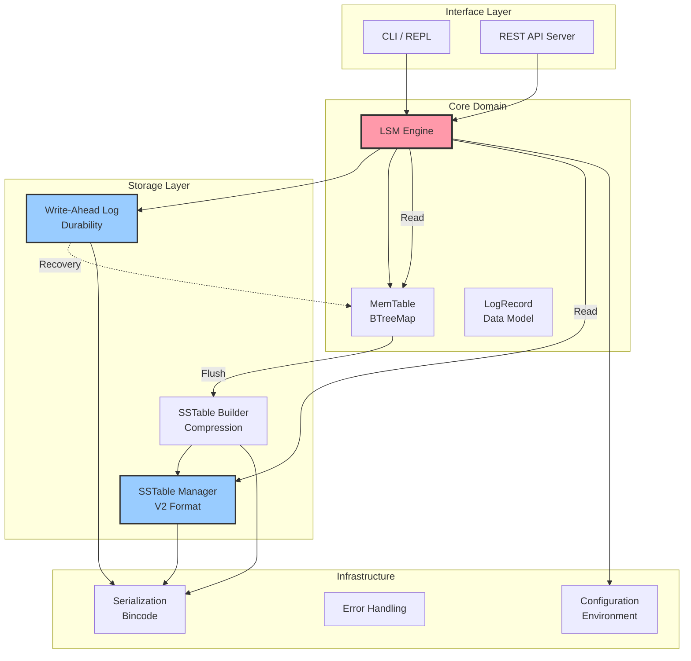
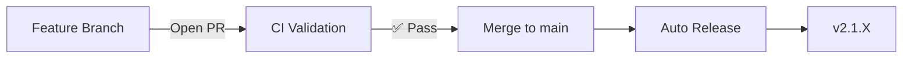

<p align="center">
  
</p>

<h1 align="center">ApexStore</h1>

<p align="center">
  <strong>High-performance, embedded Key-Value engine built with Rust 🦀</strong>
  <br />
  <em>Implementing LSM-Tree architecture with a focus on SOLID principles, observability, and performance.</em>
</p>

<p align="center">
  <a href="https://elioneto.github.io/ApexStore/"></a>
  <a href="https://opensource.org/licenses/MIT"></a>
  <a href="https://www.rust-lang.org/"></a>
  <a href="https://github.com/ElioNeto/ApexStore/releases"></a>
  <a href="https://www.docker.com/"></a>
  <a href="https://github.com/ElioNeto/ApexStore/actions/workflows/pr-validation.yml"></a>
</p>

---

## 🎯 Overview

ApexStore is a modern, Rust-based storage engine designed for write-heavy workloads. It combines the durability of write-ahead logging (WAL) with the efficiency of **Log-Structured Merge-Tree (LSM-Tree)** architecture. 

Built from the ground up using **SOLID principles**, it provides a production-grade storage solution that is easy to reason about, test, and maintain, while delivering the performance expected from a systems-level language.

## ⚖️ Why ApexStore?

While industry giants like RocksDB or LevelDB focus on extreme complexity, ApexStore offers:

- **Educational Clarity**: A clean, modular implementation of LSM-Tree that serves as a blueprint for high-performance systems.
- **Strict SOLID Compliance**: Leveraging Rust's ownership model to enforce clear boundaries between MemTable, WAL, and SSTable layers.
- **Observability First**: Built-in real-time metrics for memory, disk usage, and WAL health.
- **Modern Defaults**: Native LZ4 compression, Bloom Filters, and 35+ tunable parameters via environment variables.

## 📊 Performance Benchmarks

*Measured on AMD Ryzen 9 5900X, NVMe SSD — Full benchmark suite available at [`docs/PERFORMANCE.md`](docs/PERFORMANCE.md)*

> **Run locally:** `cargo bench --all-features` → relatórios HTML em `target/criterion/`

### 🤖 Latest CI Results

<!-- BENCHMARK_RESULTS_START -->
> 🤖 Auto-updated by CI on **2026-05-02 21:31 UTC** — [View run](https://github.com/ElioNeto/ApexStore/actions/runs/25262209702)

| Benchmark | Tempo (mediana) |
|-----------|----------------|

| `ycsb_type_a / 10000 time: [820.12 µs 825.29 µs 828.60 µs]` | 825.29 µs |
| `ycsb_type_b / 10000 time: [650.31 µs 674.84 µs 687.28 µs]` | 674.84 µs |
| `ycsb_type_c / 10000 time: [322.55 µs 324.13 µs 325.47 µs]` | 324.13 µs |
| `ycsb_type_c / 100000 time: [583.82 µs 593.69 µs 599.62 µs]` | 593.69 µs |
| `workload_balanced / 10000 time: [824.09 µs 834.41 µs 841.05 µs]` | 834.41 µs |
| `workload_read_heavy / 10000` | 733.64 µs |
| `workload_write_heavy / 10000` | 882.15 µs |
| `read_memtable / 1000 time: [136.80 µs 138.20 µs 139.63 µs]` | 138.20 µs |
| `read_memtable / 10000 time: [264.14 µs 266.79 µs 269.90 µs]` | 266.79 µs |
| `read_sstable_cold / 1000 time: [139.95 µs 142.25 µs 144.12 µs]` | 142.25 µs |
| `read_sstable_cold / 10000 time: [243.13 µs 245.65 µs 249.45 µs]` | 245.65 µs |
| `read_sstable_warm / 1000 time: [140.52 µs 142.09 µs 143.90 µs]` | 142.09 µs |
| `read_sstable_warm / 10000 time: [243.47 µs 247.24 µs 250.98 µs]` | 247.24 µs |
| `bloom_filter / 10000 time: [1.9832 ms 2.0507 ms 2.1213 ms]` | 2.0507 ms |
| `bloom_filter / 100000 time: [31.944 ms 32.218 ms 32.457 ms]` | 32.218 ms |
| `read_latency / memtable_1k` | 106.83 µs |
| `read_latency / sstable_cold_1k` | 145.36 µs |
| `scan_sequential / 1000 time: [138.02 µs 139.32 µs 141.09 µs]` | 139.32 µs |
| `scan_sequential / 10000 time: [1.7773 ms 1.7813 ms 1.7872 ms]` | 1.7813 ms |
| `full_scan / 1000 time: [144.30 µs 145.90 µs 147.45 µs]` | 145.90 µs |
| `full_scan / 10000 time: [2.0813 ms 2.1043 ms 2.1379 ms]` | 2.1043 ms |
| `range_scan_100 / 100 time: [6.8891 ms 6.9473 ms 7.0535 ms]` | 6.9473 ms |
| `range_scan_1000 / 1000 time: [7.2104 ms 7.3029 ms 7.3804 ms]` | 7.3029 ms |
| `prefix_scan_100 / 100 time: [865.13 µs 874.68 µs 883.89 µs]` | 874.68 µs |
| `prefix_scan_1000 / 1000 time: [1.0699 ms 1.0749 ms 1.0787 ms]` | 1.0749 ms |
| `iteration_sorted / 1000 time: [173.25 µs 174.38 µs 175.70 µs]` | 174.38 µs |
| `iteration_sorted / 10000 time: [2.1238 ms 2.1293 ms 2.1381 ms]` | 2.1293 ms |
| `scan_limit_10 / 10 time: [2.5731 µs 2.5954 µs 2.6115 µs]` | 2.5954 µs |
| `scan_limit_100 / 100 time: [23.638 µs 23.735 µs 23.848 µs]` | 23.735 µs |
| `scan_limit_1000 / 1000 time: [235.16 µs 236.44 µs 237.84 µs]` | 236.44 µs |
| `scan_pagination / 10 time: [862.16 µs 867.57 µs 871.45 µs]` | 867.57 µs |
| `scan_pagination / 100 time: [75.984 ms 76.368 ms 76.748 ms]` | 76.368 ms |
| `sstable_layer_1 / 1 time: [2.0199 ms 2.0264 ms 2.0340 ms]` | 2.0264 ms |
| `sstable_layer_3 / 3 time: [6.4222 ms 6.4481 ms 6.4888 ms]` | 6.4481 ms |
| `sstable_layer_10 / 10 time: [24.502 ms 24.770 ms 24.898 ms]` | 24.770 ms |
| `concurrent_1_threads / 1 time: [2.6311 ms 2.6809 ms 2.7283 ms]` | 2.6809 ms |
| `concurrent_2_threads / 2 time: [2.9239 ms 2.9482 ms 2.9774 ms]` | 2.9482 ms |
| `memory_pressure / small_memtable` | 4.8870 ms |
| `many_sstables_10 / 10 time: [230.08 µs 232.36 µs 235.38 µs]` | 232.36 µs |
| `many_sstables_50 / 50 time: [315.37 µs 318.02 µs 320.42 µs]` | 318.02 µs |
| `cache_thrash_16MB / 16 time: [80.146 µs 81.032 µs 83.087 µs]` | 81.032 µs |
| `cache_thrash_64MB / 64 time: [79.431 µs 79.960 µs 80.427 µs]` | 79.960 µs |
| `key_updates / 10k_keys time: [8.0228 ms 8.0665 ms 8.0988 ms]` | 8.0665 ms |
| `delete_operations / 10k_keys` | 1.4302 ms |
| `write_single / 10 time: [164.73 ns 165.08 ns 165.47 ns]` | 165.08 ns |
| `write_single / 100 time: [165.93 ns 166.11 ns 166.26 ns]` | 166.11 ns |
| `write_single / 1024 time: [196.22 ns 199.38 ns 202.58 ns]` | 199.38 ns |
| `write_single / 10240 time: [795.75 ns 797.11 ns 798.39 ns]` | 797.11 ns |
| `write_batch_1000 / 1000 time: [345.44 µs 347.41 µs 348.58 µs]` | 347.41 µs |
| `write_batch_10000 / 10000 time: [6.5341 ms 6.5833 ms 6.6134 ms]` | 6.5833 ms |
| `write_batch_100000 / 100000` | 199.13 ms |
| `memtable_flush_8 / 8 time: [42.016 ms 42.794 ms 43.210 ms]` | 42.794 ms |
| `sstable_flush / 100000 time: [197.29 ms 199.16 ms 201.05 ms]` | 199.16 ms |
| `write_size_10_10 / 10x10 time: [164.59 ns 164.99 ns 165.29 ns]` | 164.99 ns |
| `write_size_10_100 / 10x100` | 167.69 ns |
| `write_size_100_100 / 100x100` | 171.60 ns |
| `write_size_100_1000 / 100x1000` | 173.10 ns |
| `write_size_100_10000 / 100x10000` | 173.02 ns |

<!-- BENCHMARK_RESULTS_END -->


### 📋 Reference Benchmarks

*Baseline medido manualmente (AMD Ryzen 9 5900X, NVMe SSD, v2.1.0)*

#### Throughput
| Operation | Throughput | p50 Latency | p99 Latency |
|-----------|------------|-------------|-------------|
| **MemTable Writes** | 650K ops/s | 1.5 µs | 3.2 µs |
| **WAL Async Writes** | 120K ops/s | 8.2 µs | 24.5 µs |
| **WAL Fsync Writes** | 7.5K ops/s | 132 µs | 245 µs |
| **Batch (1K ops)** | 850K ops/s | 1.8 µs | 4.1 µs |
| **MemTable Reads** | 1.1M ops/s | 0.9 µs | 1.8 µs |
| **SSTable (warm cache)** | 75K ops/s | 13.4 µs | 42.1 µs |
| **SSTable (cold cache)** | 8.2K ops/s | 122 µs | 312 µs |

#### Scan Performance
| Operation | Throughput | p50 Latency |
|-----------|------------|-------------|
| **Full Scan** | 12.5M keys/sec | 0.08 µs/key |
| **Range Scan (1K)** | 6.2M keys/sec | 0.16 µs/key |
| **Prefix Scan** | 4.8M keys/sec | 0.21 µs/key |

#### Storage Efficiency
| Metric | Value |
|--------|-------|
| **LZ4 Compression Ratio** | 2.8x |
| **Bloom Filter FP Rate** | 0.8% |
| **Space Amplification** | 1.3x |

> **Key Insights:**
> - `WAL_SYNC_MODE=async` provides 16x throughput vs fsync (trade durability for speed)
> - Cache hit rate > 80% when `block_cache_size_mb > 256`
> - Bloom filter rejects 99.2% of non-existent key lookups
> - Optimal `memtable_max_size` is 16-32MB for write-heavy workloads

## ✨ Key Features

### 🛠️ Storage Engine
- **MemTable**: In-memory BTreeMap with configurable size limits.
- **Write-Ahead Log (WAL)**: ACID-compliant durability with configurable sync modes.
- **SSTable V2**: Block-based storage with Sparse Indexing and LZ4 Compression.
- **Bloom Filters**: Drastically reduces unnecessary disk I/O for read operations.
- **Crash Recovery**: Automatic WAL replay on startup to ensure zero data loss.

### 🔌 Access Patterns
- **Interactive CLI**: REPL interface for development and debugging.
- **REST API**: Full HTTP API with JSON payloads for microservices.
- **Batch Operations**: Efficient bulk inserts and updates.
- **Search Capabilities**: Prefix and substring search (Optimized iterators coming in v2.0).

## 🏗️ Architecture

The engine follows a modular architecture where each component has a single responsibility:


```mermaid
graph TB
    subgraph "Interface Layer"
        CLI[CLI / REPL]
        API[REST API Server]
    end

    subgraph "Core Domain"
        Engine[LSM Engine]
        MemTable[MemTable<br/>BTreeMap]
        LogRecord[LogRecord<br/>Data Model]
    end

    subgraph "Storage Layer"
        WAL[Write-Ahead Log<br/>Durability]
        SST[SSTable Manager<br/>V2 Format]
        Builder[SSTable Builder<br/>Compression]
    end

    subgraph "Infrastructure"
        Codec[Serialization<br/>Bincode]
        Error[Error Handling]
        Config[Configuration<br/>Environment]
    end

    CLI --> Engine
    API --> Engine
    Engine --> WAL
    Engine --> MemTable
    MemTable -->|Flush| Builder
    Builder --> SST
    Engine -->|Read| MemTable
    Engine -->|Read| SST
    WAL -.->|Recovery| MemTable
    
    Engine --> Config
    SST --> Codec
    Builder --> Codec
    WAL --> Codec

    style Engine fill:#f9a,stroke:#333,stroke-width:3px
    style WAL fill:#9cf,stroke:#333,stroke-width:2px
    style SST fill:#9cf,stroke:#333,stroke-width:2px
```

## 🚀 Quick Start

### Prerequisites
- **Rust 1.70+**: Install via [rustup.rs](https://rustup.rs/)

### Installation & Run
```bash
# Clone and enter
git clone https://github.com/ElioNeto/ApexStore.git && cd ApexStore

# Build and Start REPL
cargo run --release

# Available commands:
# > put user:1 "John Doe"
# > get user:1
# > stats
```

## 🐳 Docker Deployment

Run ApexStore as a standalone API server:

```bash
# Start with Docker Compose
docker-compose up -d

# Manual run with custom config
docker run -d \
  --name apexstore-server \
  -p 8080:8080 \
  -e MEMTABLE_MAX_SIZE=33554432 \
  -v apexstore-data:/data \
  elioneto/apexstore:latest
```

## 🌐 REST API Examples

| Method | Endpoint | Description |
|--------|----------|-------------|
| `POST` | `/keys` | Insert/Update: `{"key": "k1", "value": "v1"}` |
| `GET` | `/keys/{key}` | Retrieve value |
| `GET` | `/stats/all` | Full telemetry (Memory, Disk, WAL) |

## 📁 Project Structure

```
ApexStore/
├── src/
│   ├── core/      # LSM Engine, MemTable, Domain logic
│   ├── storage/   # WAL, SSTable V2, Block Builder
│   ├── infra/     # Codec, Error Handling, Config
│   ├── api/       # Actix-Web Server & Handlers
│   └── cli/       # REPL Implementation
├── docs/          # Detailed documentation & Architecture
├── tests/         # Integration test suite
└── Dockerfile     # Multi-stage build
```

## 🧪 Testing & Quality

```bash
cargo test                 # Run all tests
cargo clippy -- -D warnings # Linting
cargo fmt                  # Formatting
```

## 🚀 CI/CD & Development Workflow

ApexStore uses **trunk-based development** with automated releases:


```mermaid
graph LR
    A[Feature Branch] -->|Open PR| B[CI Validation]
    B -->|✅ Pass| C[Merge to main]
    C --> D[Auto Release]
    D --> E[v2.1.X]
```

### Development Flow

1. **Create feature branch** from `main`
2. **Open PR** → CI runs `cargo fmt`, `clippy`, `test`, `build`
3. **Merge PR** → Auto-increments version in `Cargo.toml`, creates tag & GitHub release

📖 **Read:** [`MIGRATION_GUIDE.md`](MIGRATION_GUIDE.md) for team workflow  
📂 **Details:** [`.github/workflows/README.md`](.github/workflows/README.md)

## 🗺️ Roadmap

- [x] SSTable V2 with compression & Bloom Filters
- [x] REST API & Feature Flags
- [x] Global Block Cache
- [x] Trunk-based CI/CD with auto-release
- [ ] **v2.2**: Storage iterators for range queries
- [ ] **v2.3**: Concurrent read optimization
- [ ] **v3.0**: Leveled/Tiered Compaction Strategies

## 🤝 Contributing

Contributions are what make the open-source community an amazing place! Please check our [Contributing Guidelines](docs/CONTRIBUTING.md).

1. Fork the Project
2. Create your Feature Branch (`git checkout -b feat/amazing-feature`)
3. Commit your Changes (`git commit -m 'feat: add amazing feature'`)
4. Push to the Branch (`git push origin feat/amazing-feature`)
5. Open a Pull Request to `main`
6. CI will auto-release on merge 🚀

## 📄 License

Distributed under the MIT License. See `LICENSE` for more information.

## 📧 Contact

**Elio Neto** - [GitHub](https://github.com/ElioNeto) - netoo.elio@hotmail.com  
**Demo**: [lsm-admin-dev.up.railway.app](https://lsm-admin-dev.up.railway.app/)

## 🌟 Star History

[](https://star-history.com/#ElioNeto/ApexStore&Date)

---
<p align="center">Built with 🦀 Rust and ❤️ for high-performance storage systems</p>
