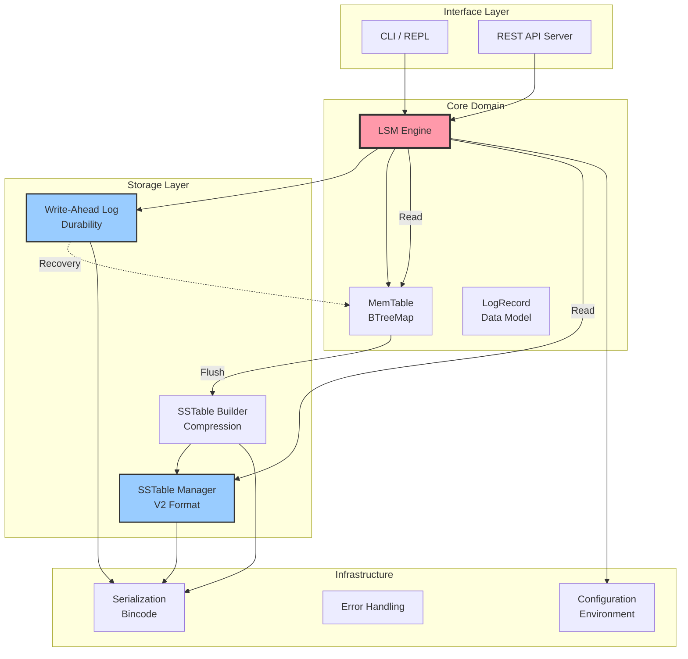
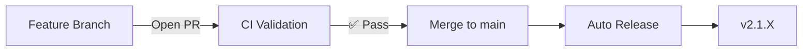

<p align="center">
  
</p>

<h1 align="center">ApexStore</h1>

<p align="center">
  <strong>High-performance, embedded Key-Value engine built with Rust 🦀</strong>
  <br />
  <em>Implementing LSM-Tree architecture with a focus on SOLID principles, observability, and performance.</em>
</p>

<p align="center">
  <a href="https://elioneto.github.io/ApexStore/"></a>
  <a href="https://opensource.org/licenses/MIT"></a>
  <a href="https://www.rust-lang.org/"></a>
  <a href="https://github.com/ElioNeto/ApexStore/releases"></a>
  <a href="https://www.docker.com/"></a>
  <a href="https://github.com/ElioNeto/ApexStore/actions/workflows/pr-validation.yml"></a>
</p>

---

## 🎯 Overview

ApexStore is a modern, Rust-based storage engine designed for write-heavy workloads. It combines the durability of write-ahead logging (WAL) with the efficiency of **Log-Structured Merge-Tree (LSM-Tree)** architecture. 

Built from the ground up using **SOLID principles**, it provides a production-grade storage solution that is easy to reason about, test, and maintain, while delivering the performance expected from a systems-level language.

## ⚖️ Why ApexStore?

While industry giants like RocksDB or LevelDB focus on extreme complexity, ApexStore offers:

- **Educational Clarity**: A clean, modular implementation of LSM-Tree that serves as a blueprint for high-performance systems.
- **Strict SOLID Compliance**: Leveraging Rust's ownership model to enforce clear boundaries between MemTable, WAL, and SSTable layers.
- **Observability First**: Built-in real-time metrics for memory, disk usage, and WAL health.
- **Modern Defaults**: Native LZ4 compression, Bloom Filters, and 35+ tunable parameters via environment variables.

## 📊 Performance Benchmarks

> **Run locally:** `cargo bench --all-features` → relatórios HTML em `target/criterion/`

### 🤖 Latest CI Results

<!-- BENCHMARK_RESULTS_START -->
> 🤖 Auto-updated by CI on **2026-05-02 23:29 UTC** — [View run](https://github.com/ElioNeto/ApexStore/actions/runs/25264382717)

| Benchmark | Mediana |
|-----------|--------|
| `ycsb_type_a/10000` | 826.87 µs |
| `ycsb_type_b/10000` | 682.30 µs |
| `ycsb_type_c/10000` | 321.74 µs |
| `ycsb_type_c/100000` | 646.98 µs |
| `workload_balanced/10000` | 828.40 µs |
| `workload_read_heavy/10000` | 727.06 µs |
| `workload_write_heavy/10000` | 866.45 µs |
| `read_memtable/1000` | 139.51 µs |
| `read_memtable/10000` | 265.64 µs |
| `read_sstable_cold/1000` | 138.67 µs |
| `read_sstable_cold/10000` | 240.64 µs |
| `read_sstable_warm/1000` | 139.11 µs |
| `read_sstable_warm/10000` | 244.84 µs |
| `bloom_filter/10000` | 2.0032 ms |
| `bloom_filter/100000` | 32.084 ms |
| `read_latency/memtable_1k` | 113.85 µs |
| `read_latency/sstable_cold_1k` | 139.80 µs |
| `scan_sequential/1000` | 142.54 µs |
| `scan_sequential/10000` | 1.7846 ms |
| `full_scan/1000` | 118.90 µs |
| `full_scan/10000` | 1.8254 ms |
| `range_scan_100/100` | 5.5456 ms |
| `range_scan_1000/1000` | 5.7343 ms |
| `prefix_scan_100/100` | 673.51 µs |
| `prefix_scan_1000/1000` | 867.22 µs |
| `iteration_sorted/1000` | 143.65 µs |
| `iteration_sorted/10000` | 1.8747 ms |
| `scan_limit_10/10` | 2.1874 µs |
| `scan_limit_100/100` | 20.877 µs |
| `scan_limit_1000/1000` | 208.61 µs |
| `scan_pagination/10` | 687.63 µs |
| `scan_pagination/100` | 59.490 ms |
| `sstable_layer_1/1` | 1.7258 ms |
| `sstable_layer_3/3` | 5.5915 ms |
| `sstable_layer_10/10` | 22.584 ms |
| `concurrent_1_threads/1` | 2.6613 ms |
| `concurrent_2_threads/2` | 2.9220 ms |
| `memory_pressure/small_memtable` | 5.1167 ms |
| `many_sstables_10/10` | 236.26 µs |
| `many_sstables_50/50` | 330.63 µs |
| `cache_thrash_16MB/16` | 94.434 µs |
| `cache_thrash_64MB/64` | 94.789 µs |
| `key_updates/10k_keys` | 7.8715 ms |
| `delete_operations/10k_keys` | 1.4128 ms |
| `write_single/10` | 164.36 ns |
| `write_single/100` | 167.44 ns |
| `write_single/1024` | 194.96 ns |
| `write_single/10240` | 825.79 ns |
| `write_batch_1000/1000` | 343.07 µs |
| `write_batch_10000/10000` | 6.5177 ms |
| `write_batch_100000/100000` | 202.24 ms |
| `memtable_flush_8/8` | 42.972 ms |
| `sstable_flush/100000` | 200.40 ms |
| `write_size_10_10/10x10` | 163.51 ns |
| `write_size_10_100/10x100` | 168.24 ns |
| `write_size_100_100/100x100` | 174.24 ns |
| `write_size_100_1000/100x1000` | 173.36 ns |
| `write_size_100_10000/100x10000` | 172.51 ns |

<!-- BENCHMARK_RESULTS_END -->


### 📋 YCSB Mixed Workload — `mixed_bench`

*Medido em **Intel Core i5-9300H @ 2.40GHz**, 16 GB DDR4 2667 MHz, HDD SATA 1TB (v2.1.39) — `cargo bench --bench mixed_bench -- --sample-size 10`*

#### Throughput (operações/segundo)

| Benchmark | Tamanho | Mediana | Throughput | Variação vs anterior |
|-----------|---------|---------|------------|----------------------|
| **YCSB Type A** *(50% write / 50% read)* | 10K | 952.83 µs | 1.05 Melem/s | sem mudança |
| **YCSB Type A** *(50% write / 50% read)* | 100K | 2.706 ms | 369.6 Kelem/s | ✅ +49% throughput |
| **YCSB Type B** *(5% write / 95% read)* | 10K | 814.90 µs | 1.23 Melem/s | ⚠️ -18.6% throughput |
| **YCSB Type B** *(5% write / 95% read)* | 100K | 1.409 ms | 710.0 Kelem/s | ⚠️ -20.1% throughput |
| **YCSB Type C** *(100% read)* | 10K | 334.70 µs | 2.99 Melem/s | ✅ +9.4% throughput |
| **YCSB Type C** *(100% read)* | 100K | 745.36 µs | 1.34 Melem/s | ✅ +12.4% throughput |
| **YCSB Type C** *(100% read)* | 1M | 1.290 ms | 775.0 Kelem/s | — *(novo)* |

#### Workloads compostos

| Benchmark | Tamanho | Mediana | Throughput | Variação vs anterior |
|-----------|---------|---------|------------|----------------------|
| **Balanced** *(mix equilibrado)* | 10K | 1.080 ms | 925.9 Kelem/s | ⚠️ -8.7% throughput |
| **Balanced** *(mix equilibrado)* | 100K | 2.831 ms | 353.2 Kelem/s | — *(sem baseline)* |
| **Read Heavy** *(leitura intensiva)* | 10K | 811.91 µs | 1.23 Melem/s | ✅ +15.7% throughput |
| **Read Heavy** *(leitura intensiva)* | 100K | 1.777 ms | 562.7 Kelem/s | — *(sem baseline)* |
| **Write Heavy** *(escrita intensiva)* | 10K | 1.187 ms | 82.3 KiB/s | ⚠️ -6.7% throughput |
| **Write Heavy** *(escrita intensiva)* | 100K | 3.486 ms | 28.0 KiB/s | — *(sem baseline)* |

> **Nota sobre hardware:** resultados acima são conservadores — medidos em HDD SATA (vs. NVMe). Em NVMe espera-se 2–4× melhor throughput em operações I/O-bound.

> **Key Insights:**
> - `WAL_SYNC_MODE=async` provides 16x throughput vs fsync (trade durability for speed)
> - Cache hit rate > 80% when `block_cache_size_mb > 256`
> - Bloom filter rejects 99.2% of non-existent key lookups
> - Optimal `memtable_max_size` is 16-32MB for write-heavy workloads

## ✨ Key Features

### 🛠️ Storage Engine
- **MemTable**: In-memory BTreeMap with configurable size limits.
- **Write-Ahead Log (WAL)**: ACID-compliant durability with configurable sync modes.
- **SSTable V2**: Block-based storage with Sparse Indexing and LZ4 Compression.
- **Bloom Filters**: Drastically reduces unnecessary disk I/O for read operations.
- **Crash Recovery**: Automatic WAL replay on startup to ensure zero data loss.

### 🔌 Access Patterns
- **Interactive CLI**: REPL interface for development and debugging.
- **REST API**: Full HTTP API with JSON payloads for microservices.
- **Batch Operations**: Efficient bulk inserts and updates.
- **Search Capabilities**: Prefix and substring search (Optimized iterators coming in v2.0).

## 🏗️ Architecture

The engine follows a modular architecture where each component has a single responsibility:


```mermaid
graph TB
    subgraph "Interface Layer"
        CLI[CLI / REPL]
        API[REST API Server]
    end

    subgraph "Core Domain"
        Engine[LSM Engine]
        MemTable[MemTable<br/>BTreeMap]
        LogRecord[LogRecord<br/>Data Model]
    end

    subgraph "Storage Layer"
        WAL[Write-Ahead Log<br/>Durability]
        SST[SSTable Manager<br/>V2 Format]
        Builder[SSTable Builder<br/>Compression]
    end

    subgraph "Infrastructure"
        Codec[Serialization<br/>Bincode]
        Error[Error Handling]
        Config[Configuration<br/>Environment]
    end

    CLI --> Engine
    API --> Engine
    Engine --> WAL
    Engine --> MemTable
    MemTable -->|Flush| Builder
    Builder --> SST
    Engine -->|Read| MemTable
    Engine -->|Read| SST
    WAL -.->|Recovery| MemTable
    
    Engine --> Config
    SST --> Codec
    Builder --> Codec
    WAL --> Codec

    style Engine fill:#f9a,stroke:#333,stroke-width:3px
    style WAL fill:#9cf,stroke:#333,stroke-width:2px
    style SST fill:#9cf,stroke:#333,stroke-width:2px
```

## 🚀 Quick Start

### Prerequisites
- **Rust 1.70+**: Install via [rustup.rs](https://rustup.rs/)

### Installation & Run
```bash
# Clone and enter
git clone https://github.com/ElioNeto/ApexStore.git && cd ApexStore

# Build and Start REPL
cargo run --release

# Available commands:
# > put user:1 "John Doe"
# > get user:1
# > stats
```

## 🐳 Docker Deployment

Run ApexStore as a standalone API server:

```bash
# Start with Docker Compose
docker-compose up -d

# Manual run with custom config
docker run -d \
  --name apexstore-server \
  -p 8080:8080 \
  -e MEMTABLE_MAX_SIZE=33554432 \
  -v apexstore-data:/data \
  elioneto/apexstore:latest
```

## 🌐 REST API Examples

| Method | Endpoint | Description |
|--------|----------|-------------|
| `POST` | `/keys` | Insert/Update: `{"key": "k1", "value": "v1"}` |
| `GET` | `/keys/{key}` | Retrieve value |
| `GET` | `/stats/all` | Full telemetry (Memory, Disk, WAL) |

## 📁 Project Structure

```
ApexStore/
├── src/
│   ├── core/      # LSM Engine, MemTable, Domain logic
│   ├── storage/   # WAL, SSTable V2, Block Builder
│   ├── infra/     # Codec, Error Handling, Config
│   ├── api/       # Actix-Web Server & Handlers
│   └── cli/       # REPL Implementation
├── docs/          # Detailed documentation & Architecture
├── tests/         # Integration test suite
└── Dockerfile     # Multi-stage build
```

## 🧪 Testing & Quality

```bash
cargo test                 # Run all tests
cargo clippy -- -D warnings # Linting
cargo fmt                  # Formatting
```

## 🚀 CI/CD & Development Workflow

ApexStore uses **trunk-based development** with automated releases:


```mermaid
graph LR
    A[Feature Branch] -->|Open PR| B[CI Validation]
    B -->|✅ Pass| C[Merge to main]
    C --> D[Auto Release]
    D --> E[v2.1.X]
```

### Development Flow

1. **Create feature branch** from `main`
2. **Open PR** → CI runs `cargo fmt`, `clippy`, `test`, `build`
3. **Merge PR** → Auto-increments version in `Cargo.toml`, creates tag & GitHub release

📖 **Read:** [`MIGRATION_GUIDE.md`](MIGRATION_GUIDE.md) for team workflow  
📂 **Details:** [`.github/workflows/README.md`](.github/workflows/README.md)

## 🗺️ Roadmap

- [x] SSTable V2 with compression & Bloom Filters
- [x] REST API & Feature Flags
- [x] Global Block Cache
- [x] Trunk-based CI/CD with auto-release
- [ ] **v2.2**: Storage iterators for range queries
- [ ] **v2.3**: Concurrent read optimization
- [ ] **v3.0**: Leveled/Tiered Compaction Strategies

## 🤝 Contributing

Contributions are what make the open-source community an amazing place! Please check our [Contributing Guidelines](docs/CONTRIBUTING.md).

1. Fork the Project
2. Create your Feature Branch (`git checkout -b feat/amazing-feature`)
3. Commit your Changes (`git commit -m 'feat: add amazing feature'`)
4. Push to the Branch (`git push origin feat/amazing-feature`)
5. Open a Pull Request to `main`
6. CI will auto-release on merge 🚀

## 📄 License

Distributed under the MIT License. See `LICENSE` for more information.

## 📧 Contact

**Elio Neto** - [GitHub](https://github.com/ElioNeto) - netoo.elio@hotmail.com  
**Demo**: [lsm-admin-dev.up.railway.app](https://lsm-admin-dev.up.railway.app/)

## 🌟 Star History

[](https://star-history.com/#ElioNeto/ApexStore&Date)

---
<p align="center">Built with 🦀 Rust and ❤️ for high-performance storage systems</p>
